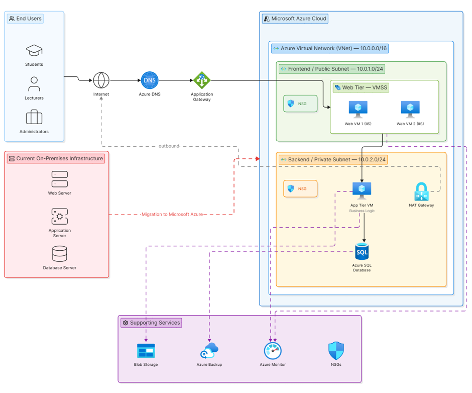
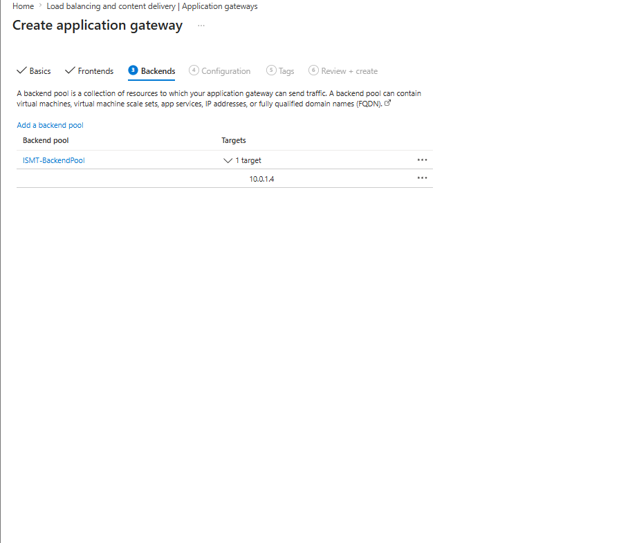
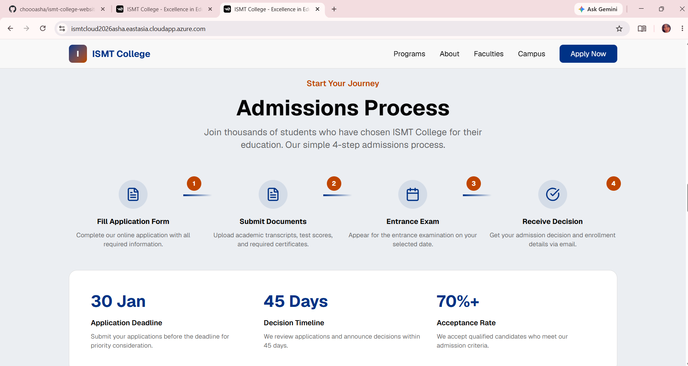
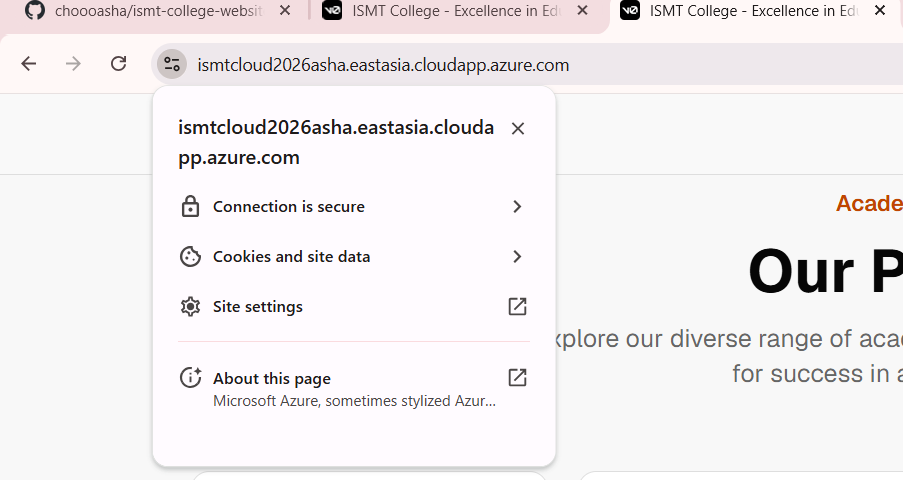
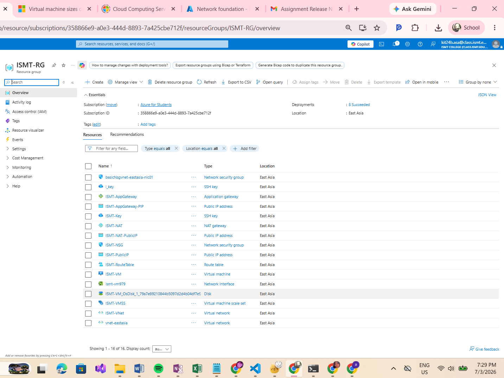

# ISMT College: Azure Cloud Migration & Deployment

A Cloud Computing project built as part of my coursework (BSc. Computer System Engineering), designing and deploying a three-tier cloud architecture on Microsoft Azure to migrate ISMT College's on-premises infrastructure to the cloud.

## Problem

ISMT College's website and services ran on on-premises infrastructure (web server, application server, database server), which limits scalability and makes handling demand spikes (e.g. admissions season) harder. The goal was to design and deploy a secure, scalable Azure architecture to host the college website.

## Architecture

Designed a three-tier Azure Virtual Network with public and private subnets, separating the web tier, application tier, and database from direct internet exposure.

**Key components configured:**
- **Azure Virtual Network (VNet)** with public (frontend) and private (backend) subnets
- **Virtual Machines (Ubuntu 22.04 LTS)** hosting the website via Git + Nginx
- **Virtual Machine Scale Set (VMSS)** for auto-scaling during high-demand periods (admissions, exam results)
- **Application Gateway** for load balancing across web VMs and secure HTTP/HTTPS traffic
- **NAT Gateway** for secure outbound internet access from the private subnet
- **Network Security Groups (NSGs)** to restrict traffic to only authorized ports (HTTP, HTTPS, SSH)
- **Route Tables** to direct traffic correctly between tiers
- **Azure SQL Database & Blob Storage** recommended for future academic/admin systems

## Deployment

The website was deployed on an Azure VM using open-source tools like Ubuntu Linux, Git (to pull the site from GitHub), and Nginx (as a reverse proxy).

## Testing & Validation

After deployment, I validated that the site was live, secured with HTTPS, and that the underlying Azure resources were running as expected.

## Result

Successfully migrated and deployed a working website on Azure with 16 provisioned resources: VNet, VM, VMSS, Application Gateway, NAT Gateway, NSGs, Route Tables, and supporting public IPs accessible over HTTPS on a custom cloud domain.

## Tools Used

Microsoft Azure (VNet, VM, VMSS, Application Gateway, NAT Gateway, NSGs, Route Tables) · Ubuntu Linux · Git · Nginx
